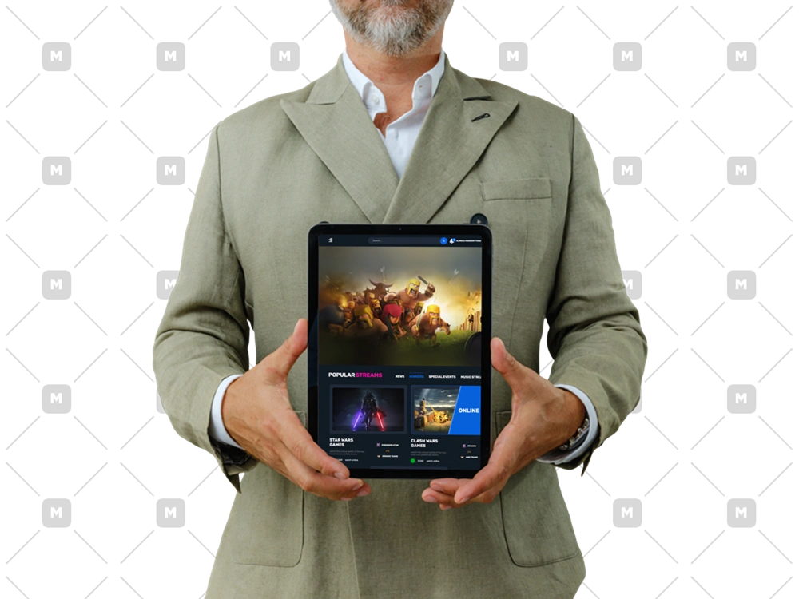
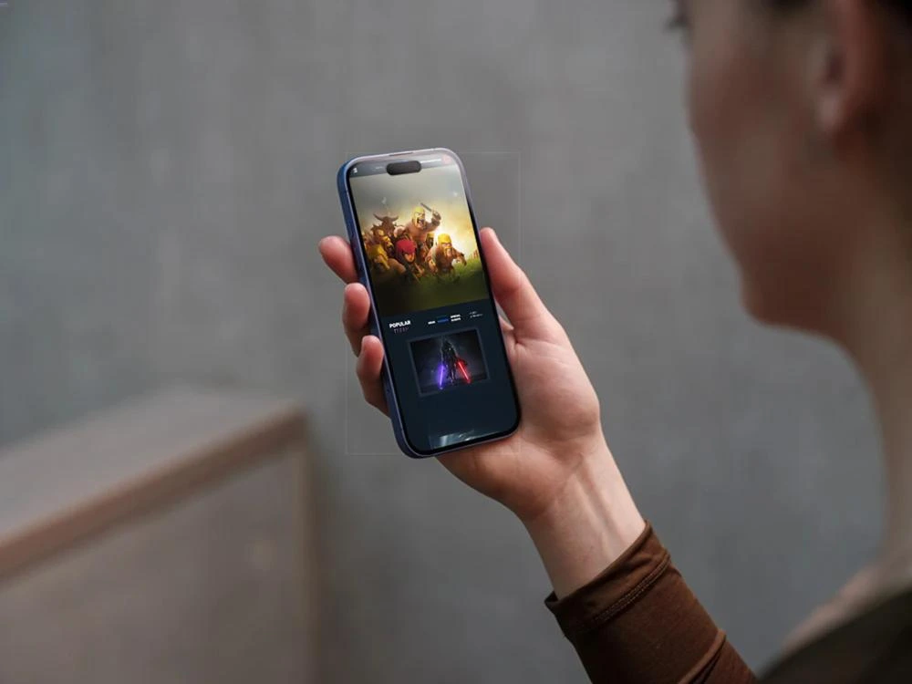

# 🎮 Play Too — Responsive Tournament Platform

**A fully responsive front-end website built with HTML, CSS, and SCSS.**  
Play Too is a fictional platform that displays tournaments, results, and friends — all designed to create a social and competitive experience for gamers.

---

### 🌐 **Live Demo**

👉 [Click here to view the project](https://magical-boba-10e6c1.netlify.app/)

---

### 🖼️ **Preview**

---

### 🧠 **About the Project**

This project is a **modern and clean front-end design** inspired by gaming platforms.  
It includes:

- Tournament listings (recent & popular)
- A sidebar with friends list and interactions
- Fully responsive layout for all devices — from mobile to large desktops
- Built with **pure HTML, CSS, and SCSS** (no frameworks)

---

### ⚙️ **Tech Stack**

- **HTML5**
- **CSS3**
- **SCSS (Sass)**

---

### 🧩 **Features**

- Responsive design for all screen sizes
- Organized and maintainable SCSS structure
- Modern UI design for gaming and eSports themes

---

### 📄 **License**

This project is created for **educational and portfolio purposes**.  
You are free to explore and learn from it.

---

---

# 🎮 Play Too — Responsives Turnier-Portal

**Eine vollständig responsive Frontend-Webseite, erstellt mit HTML, CSS und SCSS.**  
Play Too ist eine fiktive Plattform, die Turniere, Ergebnisse und Freunde anzeigt – entwickelt, um ein soziales und wettbewerbsorientiertes Spielerlebnis zu schaffen.

---

### 🌐 **Live-Demo**

👉 [Projekt hier ansehen](https://magical-boba-10e6c1.netlify.app/)

---

### 🖼️ **Vorschau**

---

### 🧠 **Über das Projekt**

Dieses Projekt ist ein **modernes und sauberes Frontend-Design**, inspiriert von Gaming-Plattformen.  
Es beinhaltet:

- Turnierlisten (aktuell & beliebt)
- Eine Seitenleiste mit Freundesliste und Interaktionen
- Vollständig responsive Layouts für alle Geräte
- Erstellt mit **purem HTML, CSS und SCSS** (ohne Frameworks)

---

### ⚙️ **Technologien**

- **HTML5**
- **CSS3**
- **SCSS (Sass)**

---

### 🧩 **Funktionen**

- Responsives Design für alle Bildschirmgrößen
- Saubere, gut strukturierte SCSS-Dateien
- Modernes UI-Design im Gaming-Stil

---

### 📄 **Lizenz**

Dieses Projekt wurde **zu Lern- und Portfoliozwecken** erstellt.  
Du kannst es gerne erkunden und davon lernen.
